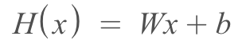
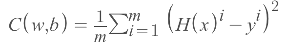

## AI Theories

### 2023/02/28
## Linear Regression

### 2023/03/04

#### What is Regression
Regression means the power or tendency that tries to go to the mean of given dataset.

#### What is Linear Regression
Linear Regression divide given data set in half

#### Key Vocabs
- Weights: Weight is a variable that affects next training and gives more weights for certain judgement of AI. 
- Bias: It can be considered as default value that helps to judge given data set.
- Cost:

### Hypothesis & Cost of Linear Regression
#### Hypothesis

#### Cost

